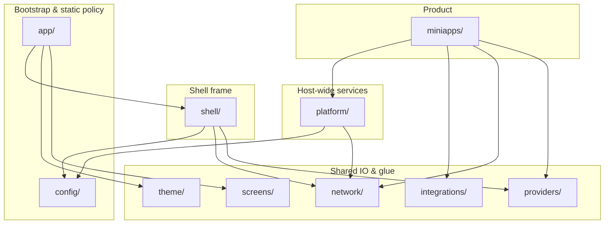

# Host `lib/src/` layout (`emp_ai_boilerplate_app`)

**Single map** of **where code belongs** in the sample super-app host. Product language may say “feature” for everything; **this doc uses fixed folder roles** so the tree stays navigable as the app grows.

---

## Diagram (roles and typical dependencies)

Rough **dependency direction** (higher layers may use lower; avoid the reverse):

**Intuition:** **mini-apps** ship product UI and domain; **shell** owns router + chrome; **platform** owns flags/analytics/push/gate; **app** wires `runApp`; **config** holds flavors and RBAC tables; **integrations** + **network** are technical adapters.

---

## Every top-level folder under `lib/src/`

| Folder | Role | Put here | Do **not** put here |
|--------|------|----------|---------------------|
| **`app/`** | **Composition root:** `MaterialApp.router`, startup (`loadBoilerplateStartupOverrides`: CachedQuery, Firebase, auth bootstrap, app-link seed). | Entry wiring that must run once before UI. | Product business logic, API clients, or mini-app screens. |
| **`config/`** | **Environment & policy as data:** flavor catalog, `ApplicationHostProfile`, RBAC route table, host mode, auth client config, experimental compile-time flags. | Values and tables that change per flavor/CI but are not “services.” | Riverpod for analytics/flags (use **`platform/`**), routes (use **`shell/router/`**). |
| **`shell/`** | **Frame:** `GoRouter`, redirects, shell scaffold, hub, drawer, **auth wiring** (token refresh, session reader), deep links. | Anything that defines *how users move* between areas and how auth attaches to navigation. | Leave/T&A/announcements **product** implementation (use **`miniapps/`**). |
| **`platform/`** | **Host capabilities:** feature flags, analytics sinks, notification **ports**, Firebase init, **`MiniAppGate`**, future maintenance/version policy. | Code that defines **how the host behaves** for all mini-apps. | A single product’s screens or repositories. |
| **`miniapps/`** | **Product modules:** each slice with `data/` · `domain/` · `presentation/` (+ optional `MiniApp` registration). | User-facing areas (announcements, samples, future leave/T&A, …). | Global router assembly ( **`shell/`** ) or global analytics wiring ( **`platform/`** ). |
| **`integrations/`** | **Shared adapters** to specific backends/SDKs used by **more than one** mini-app (or clearly shared). | Employee-assignment HTTP, auth stubs, thin BFF clients reused across products. | Host-only analytics/FCM ( **`platform/`** ). |
| **`network/`** | **Host HTTP stack:** `Dio` factory, auth header interceptor, token-refresh interceptor. | Cross-cutting HTTP behavior for the host `Dio`. | Feature-specific URLs/DTOs (live in that **mini-app’s `data/`**). |
| **`providers/`** | **Small, generic Riverpod** that does not deserve its own `platform/` subfolder yet. | e.g. `shared_preferences` singleton. | New “capability” areas—prefer **`platform/<name>/`** so they can grow with `data/domain` later. |
| **`screens/`** | **Top-level routes** that are **not** owned by one mini-app’s slice. | Login, landing, theme settings—global entry/utility screens. | Product flows that belong to a mini-app (put under **`miniapps/<id>/presentation/`**). |
| **`theme/`** | **Branding glue** for Northstar: tokens, theme mode, accent seed notifiers. | App-wide visual configuration tied to `MaterialApp`. | Business rules. **Clone checklist:** [design_system.md § Boilerplate host theming](../design/design_system.md#boilerplate-host-theming-checklist). |

---

## Quick reference: where code belongs

| X | Folder |
|---|--------|
| New Hub product (Leave, T&A, …) | `miniapps/<product_id>/` |
| Register **external** package or WebView mini-app | `miniapps/miniapp_host_catalog.dart` → **`kHostMiniAppsCatalog`** ([onboarding doc](miniapp_packages_and_extract.md)) |
| New main-shell **route** | `shell/router/boilerplate_shell_routes.dart` + `shell/navigation/boilerplate_shell_paths.dart` |
| Main-shell **menu** (side rail / drawer / bottom bar / narrow segments) | `shell/navigation/boilerplate_shell_nav_config.dart` (**`boilerplateShellNavConfigProvider`**) — keep leaf **`location`** values in sync with `GoRouter` |
| Shell **reusable UI** (rail tiles, branding, drawer sections) | `shell/navigation/widgets/` — also register previews in **`boilerplate_host_widget_catalog_entries.dart`** if they should appear under **Components** |
| Shell **state without UI** (parent open/closed) | `shell/navigation/shell_nav_expansion.dart` |
| Scaffold **assembly** (hover rail width, `LayoutBuilder`, app bar) | `shell/navigation/boilerplate_shell_scaffold.dart` |
| RBAC: who can open that route | `config/boilerplate_route_access.dart` (+ public paths in `shell/router/`) |
| Remote config / kill switch / maintenance UI | `platform/maintenance/` (grow from README) |
| Force upgrade / min version | `platform/app_version/` |
| Mixpanel, Firebase, `analyticsSinkProvider` | `platform/analytics/` |
| FCM, local notification ports | `platform/notifications/` |
| `MiniAppGate`, remote registry + flag filtering for hub | `platform/miniapps_registry/` (`mini_app_gate.dart`, `domain/`, `data/`, `di/miniapps_registry_providers.dart`) |
| Flag keys + `FeatureFlagSource` | `platform/feature_flags/` |
| Shared REST for profile id used by 2+ mini-apps | `integrations/<system>/` |
| `Dio` + interceptors | `network/` |
| `runApp` / `ProviderScope` overrides | `app/` |
| Flavor URLs, OAuth ids | `config/` + `BoilerplateEnvironmentCatalog` |

---

## Documentation strategy (avoid confusion)

| Location | Purpose |
|----------|---------|
| **`docs/engineering/host_structure.md`** (this file) | **Canonical** diagram + tables + code-location guide — link it from PRs and onboarding. |
| **`apps/.../lib/src/README.md`** | **One screen** in the IDE: “start here” + link to this doc. |
| **`lib/src/shell/README.md`**, **`lib/src/platform/README.md`** | **Optional stubs**: one short paragraph + link **back here** so we do not maintain three copies of the same tables. |
| **`lib/src/platform/<capability>/README.md`** | Use for **placeholders** (maintenance, app_version) where the folder is empty except intent. |

**Rule:** detailed explanations live under **`docs/`**; **`lib/**/README.md`** files stay short and point to **`docs/engineering/host_structure.md`** so growth does not multiply outdated copies.

---

## Related docs

- [Engineering docs hub](README.md) — four links to read first
- IDE entry: [`apps/emp_ai_boilerplate_app/lib/src/README.md`](../../apps/emp_ai_boilerplate_app/lib/src/README.md)
- [Mini-app vs feature](mini_app_vs_feature.md)
- [Architecture](architecture.md) (layers inside each mini-app)
- [Mini-apps](miniapps.md) (registry, codegen)
- [Navigation](../integrations/navigation.md)
- [Integrations index](../integrations/README.md) — **documentation tree** under `docs/integrations/`; not the same folder as **`lib/src/integrations/`** (Dart adapters)
