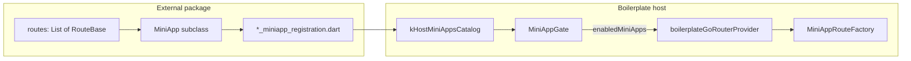

# Onboarding external mini-apps (package, submodule, WebView)

This is the **only** supported pattern for **super-app** builds. Teams **must** follow the syntax below; the host **must** merge external modules only through **`kHostMiniAppsCatalog`**.

**Contract:** every onboarded module is a [`MiniApp`](https://github.com/maplepam/ecosystem-platform/blob/main/packages/emp_ai_app_shell/lib/src/mini_app.dart) from **`emp_ai_app_shell`**, mounted under **`/${MiniApp.id}/`** ([`MiniAppRouteFactory`](https://github.com/maplepam/ecosystem-platform/blob/main/packages/emp_ai_app_shell/lib/src/mini_app_route_factory.dart)).

**Host merge file (do not bypass):** [`miniapp_host_catalog.dart`](../../apps/emp_ai_boilerplate_app/lib/src/miniapps/miniapp_host_catalog.dart) exports **`kHostMiniAppsCatalog`**. In **super-app** mode, [`MiniAppGate`](../../apps/emp_ai_boilerplate_app/lib/src/platform/miniapps_registry/mini_app_gate.dart) filters that list and [`boilerplateGoRouterProvider`](../../apps/emp_ai_boilerplate_app/lib/src/shell/router/boilerplate_router.dart) feeds it into **`MiniAppRouteFactory`**. **`miniapp_catalog.g.dart`** stays codegen-only; you **append** external apps in the host catalog. **Do not** register the same **`id`** twice (codegen + external).

---

## Contract at a glance (package team vs host team)

| **Mini-app / package team delivers** | **Boilerplate host team integrates** |
| ------------------------------------ | ------------------------------------ |
| Dart package with **`emp_ai_app_shell`** + **`go_router`** aligned to the host’s major versions (see §A.1). | **`pubspec.yaml`**: `path:` or pinned `git:` dependency on the package. |
| **`lib/<package_name>_miniapp_registration.dart`** exporting **`<camelCasePackageName>MiniappRegistrations`** → `List<MiniApp>`. | **[`miniapp_host_catalog.dart`](../../apps/emp_ai_boilerplate_app/lib/src/miniapps/miniapp_host_catalog.dart):** `import` registration + `...<camelCase>MiniappRegistrations` into **`kHostMiniAppsCatalog`**. |
| One **`MiniApp`** subclass per product area: stable **`id`**, **`displayName`**, **`entryLocation`**, **`routes`** (child segments only), optional **`requiredFeatureFlagKey`** or **`MiniAppAlwaysOn`**. | **RBAC:** prefix rules for **`/<id>`** in [`boilerplate_route_access.dart`](../../apps/emp_ai_boilerplate_app/lib/src/config/boilerplate_route_access.dart) (and **public** prefixes in [`boilerplate_public_paths.dart`](../../apps/emp_ai_boilerplate_app/lib/src/shell/router/boilerplate_public_paths.dart) if unauthenticated). |
| **Navigation:** deep links and in-app **`go`/`push`** use **`/$id/...`** (or **`goNamed`** on your routes); no reliance on **`/main/hub/...`** unless the host runs **standalone** and you added matching shell routes. | **Remote registry (optional):** include **`id`** in server allow-list ([`miniapps_registry.json`](../fixtures/miniapps_registry.json)); coordinate **feature-flag keys** and **analytics** as in **Platform integrations** below. |
| **Platform:** see **Platform integrations (shell ↔ package)** — flags, analytics, optional notifications; **do not** import the host app package from a reusable mini-app library. | **Platform:** register flag keys, wire **`ProviderScope` overrides** for package providers, keep **`MiniAppGate`** authoritative for app visibility ([`feature_flags.md`](../integrations/feature_flags.md), [`HOST_SERVICES.md`](../platform/HOST_SERVICES.md)). |
| **Tests** and README documenting **stable URLs** and **host mode** assumptions. | **Verify** **`AppHostMode.superApp`** for this integration path; see **Host mode vs route merge** below if you ship **standalone** / **embedded**. |

---

## How the shell merges mini-app routes (super-app)

Only **`AppHostMode.superApp`** composes **`MiniApp.routes`** into the root **`GoRouter`**. Flow:



- **`kHostMiniAppsCatalog`** = **`...kAllMiniApps`** (codegen from YAML) **plus** **`...externalRegistrations`**.
- **`MiniAppGate`** applies optional **remote allow-list** + **feature flags**, then notifies **`GoRouter`** via **`refreshListenable`** when the enabled set changes ([`mini_app_gate.dart`](../../apps/emp_ai_boilerplate_app/lib/src/platform/miniapps_registry/mini_app_gate.dart)).
- **`MiniAppRouteFactory.buildTree` / `buildTreeWithStatefulShell`** mounts each app under **`/$id/`** with nested child paths from **`MiniApp.routes`**.

**Shell (Northstar) vs mini-app:** **`boilerplateShellRoutes()`** (Overview, Hub tabs, widget catalog) is **not** defined inside your package’s **`MiniApp`**; it is host-owned. Your package owns only the subtree **`/$id/*`**. Jumping from shell UI to a package is **`context.go('/<id>/<segment>')`** or the package’s **`entryLocation`**. See [navigation.md — Super-app vs main shell](../integrations/navigation.md#super-app-and-main-shell).

---

## Host mode vs route merge (read before integrating)

| `AppHostMode` | Are **`MiniApp.routes`** from **`kHostMiniAppsCatalog`** on the router? | Where “hub” / product switching lives |
| ------------- | ------------------------------------------------------------------------ | --------------------------------------- |
| **`superApp`** | **Yes** — [`boilerplate_router.dart`](../../apps/emp_ai_boilerplate_app/lib/src/shell/router/boilerplate_router.dart) uses **`MiniAppGate`** + **`MiniAppRouteFactory`**. | **`/hub`**, outer rail (optional), branches **`/$id/*`**. |
| **`standaloneMiniApp`** | **No** — router uses **`boilerplateShellRoutes()`** only at the root; demo hub tabs are **inline** `GoRoute`s in the host, not **`MiniAppRouteFactory`**. | **Main shell** paths via **`BoilerplateShellPaths`** ([`boilerplate_shell_paths.dart`](../../apps/emp_ai_boilerplate_app/lib/src/shell/navigation/boilerplate_shell_paths.dart)). |
| **`embeddedMiniApp`** | **No** — same shell tree as standalone, under **`/$kEmbeddedPathPrefix/`**. | Prefixed shell URLs only. |

**Implication:** the **registration file + `MiniApp` contract** in §A is the supported way to attach **package-owned** route trees in **super-app** mode. If you need the same package in **standalone** or **embedded**, the host must **add** explicit **`GoRoute`s** (or a small adapter) under **`boilerplate_shell_routes.dart`** / **`boilerplate_router.dart`** — that is a **product fork** decision, not something the external package can do without host changes.

---

## A. External Dart mini-app (separate repo or submodule as a package)

### A.1 What the mini-app team **must** ship

1. **A Dart package** (e.g. repo root with `pubspec.yaml`, `lib/`). Submodule layout **must** place it under the monorepo at **`packages/<package_name>/`** (or another path referenced by `path:`).

2. **Minimum `pubspec.yaml` dependencies** (versions **must** match the host’s `go_router` / SDK major lines):

```yaml
name: acme_leave
description: Acme leave management mini-app for the super-app host.
publish_to: none

environment:
  sdk: ">=3.0.5 <4.0.0"

dependencies:
  flutter:
    sdk: flutter
  go_router: ^13.2.5
  emp_ai_app_shell:
    git:
      url: git@github.com:maplepam/ecosystem-platform.git
      path: packages/emp_ai_app_shell
      ref: <ecosystem-platform-commit-sha> # illustrative only — not kept in sync with this repo
```

**`ref`** must be the **same ecosystem-platform commit** your super-app uses (e.g. run **`git -C packages/ecosystem-platform rev-parse HEAD`** on the host monorepo, or use your org’s fork URL + SHA). The placeholder above is **not** auto-updated. Prefer a **`path:`** override for local development when the host already vendors platform as a submodule.

3. **Exactly one registration library** with this **file name**:

`lib/<package_name>_miniapp_registration.dart`

Example for package `acme_leave` → **`lib/acme_leave_miniapp_registration.dart`**.

That file **must** expose **exactly** this API (names are mandatory so hosts integrate uniformly):

```dart
import 'package:emp_ai_app_shell/emp_ai_app_shell.dart';

import 'acme_leave_miniapp.dart';

/// Host imports this file and spreads this list into [kHostMiniAppsCatalog].
List<MiniApp> get acmeLeaveMiniappRegistrations => <MiniApp>[
      AcmeLeaveMiniApp(),
    ];
```

**Rules:**

- The getter name is **`<camelCasePackageName>MiniappRegistrations`** (package `acme_leave` → `acmeLeaveMiniappRegistrations`).
- It returns a **non-empty** `List<MiniApp>` (even for a single app).
- Every element is a **`MiniApp`** (see §A.2).

4. **The `MiniApp` implementation** in the same package (e.g. `lib/acme_leave_miniapp.dart`) **must** satisfy:

```dart
import 'package:emp_ai_app_shell/emp_ai_app_shell.dart';
import 'package:flutter/material.dart';
import 'package:go_router/go_router.dart';

final class AcmeLeaveMiniApp extends MiniApp {
  AcmeLeaveMiniApp();

  @override
  String get id => 'acme_leave';

  @override
  String get displayName => 'Leave';

  /// Full path to the default child route: `/` + [id] + `/` + first segment.
  /// Example: id `acme_leave`, first route path `home` → `/acme_leave/home`.
  @override
  String get entryLocation => '/acme_leave/home';

  /// **REPLACE** with your feature-flag key, or use `with MiniAppAlwaysOn` instead of overriding.
  @override
  String? get requiredFeatureFlagKey => null;

  @override
  List<RouteBase> get routes => <RouteBase>[
        GoRoute(
          path: 'home',
          name: 'acme_leave_home',
          builder: (BuildContext context, GoRouterState state) =>
              const Placeholder(), // REPLACE with your root screen
        ),
      ];
}
```

**Always-on variant (no flag):**

```dart
final class AcmeLeaveMiniApp extends MiniApp with MiniAppAlwaysOn {
  // ...
  // omit requiredFeatureFlagKey
}
```

**Hard rules:**

- **`id`:** lowercase, `[a-z0-9_]+`, stable forever (remote registry + analytics use it).
- **`routes`:** only **child** segments; the host mounts them under **`/$id/`**. Paths **must not** start with `/`.
- **`entryLocation`:** **absolute** app path, **must** equal `/$id/<firstRoutePath>` for the default tab.

---

### A.2 Submodule (Git) — exact host steps

From the **monorepo root** (`ecosystem_boilerplate/`):

```bash
git submodule add <git@github.com:org/acme_leave.git> packages/acme_leave
git submodule update --init --recursive
```

In **`apps/emp_ai_boilerplate_app/pubspec.yaml`:**

```yaml
dependencies:
  acme_leave:
    path: ../../packages/acme_leave
```

Then run **`flutter pub get`** from `apps/emp_ai_boilerplate_app/`.

---

### A.3 Super-app integration (mandatory edits)

1. **`pubspec.yaml`** — add `path:` or `git:` dependency as above.

2. **`lib/src/miniapps/miniapp_host_catalog.dart`** — add **import** + **spread**:

```dart
import 'package:acme_leave/acme_leave_miniapp_registration.dart';

List<MiniApp> get kHostMiniAppsCatalog => <MiniApp>[
      ...kAllMiniApps,
      ...acmeLeaveMiniappRegistrations,
    ];
```

3. **`miniapps_registry.yaml` / codegen** — **optional** for external-only apps; if the mini-app is **not** in YAML, it still appears in the hub **if** it is in **`kHostMiniAppsCatalog`**. If you use codegen for docs only, keep YAML in sync with **`id`** for humans.

4. **Remote registry API** — if used, include this **`id`** in `enabled_miniapp_ids` (see [`docs/fixtures/miniapps_registry.json`](../fixtures/miniapps_registry.json)).

5. **RBAC** — add route prefixes in **`config/boilerplate_route_access.dart`** for `/acme_leave` (or your id) if the area is authenticated.

**Do not** register the same `MiniApp` in both codegen and external list twice (duplicate `id` breaks hub/router).

---

### A.4 Platform integrations (feature flags, analytics, registry, auth, notifications)

**Boundary:** **`lib/src/platform/`** in the host owns cross-cutting **capabilities** (flags, analytics sinks, **`MiniAppGate`**, Firebase bootstrap, notification ports). **`shell/`** owns **routing + auth refresh** wiring. A **reusable** external mini-app package **must not** depend on **`emp_ai_boilerplate_app`**; integrate through **shared packages** (`**emp_ai_foundation**`, `**emp_ai_app_shell**`, …) plus **documented keys** and **Riverpod overrides** at the host composition root ([`host_structure.md`](host_structure.md)).

| Concern | Package (mini-app) team | Host (boilerplate) team |
| ------- | ------------------------ | ------------------------ |
| **Feature flags (whole app on/off)** | Set **`MiniApp.requiredFeatureFlagKey`** to a **stable string** you publish in your README (e.g. **`miniapp_acme_leave_enabled`**). Use **`MiniAppAlwaysOn`** only when the app is never flag-gated. | Implement that key in **`FeatureFlagSource`** / **`BoilerplateFeatureFlags`** ([`boilerplate_feature_flags.dart`](../../apps/emp_ai_boilerplate_app/lib/src/platform/feature_flags/boilerplate_feature_flags.dart)). **[`MiniAppGate`](../../apps/emp_ai_boilerplate_app/lib/src/platform/miniapps_registry/mini_app_gate.dart)** calls **`filterMiniAppsByFeatureFlags`** — the hub and **super-app** router only see enabled apps. |
| **Feature flags (in-app UI toggles)** | Read flags from a **`Provider`** you own: default to safe **`false`** / no-op, and **document** the keys. Optionally depend on **`emp_ai_foundation`**’s **`FeatureFlagSource`** and take **`Future<bool> isEnabled`** in notifiers if you avoid **`emp_ai_boilerplate_app`**. | Override the package’s providers (or expose a thin **`FeatureFlagSource`** wrapper) from **`featureFlagSourceProvider`** / **`boilerplateFeatureFlagsProvider`** at **`ProviderScope`** in **`app/`**. |
| **Remote mini-app registry** | Document **`MiniApp.id`** for ops; expect the host to **omit** your app from **`enabled_miniapp_ids`** when the server should hide it (before flags). | Configure **`MINIAPPS_REGISTRY_URL`** / DTO; gate still combines with **feature flags** ([`miniapps.md`](miniapps.md)). |
| **Analytics** | Prefer **`AnalyticsSink`** from **`emp_ai_foundation`** ([`HOST_SERVICES.md`](../platform/HOST_SERVICES.md)): define e.g. **`Provider<AnalyticsSink>`** in the package with default **`NoOpAnalyticsSink`**, call **`track` / `identify` / `reset`** from presentation only — **not** from **`domain/`**. Document **event name** conventions (prefix with **`id`** to avoid collisions, e.g. **`acme_leave_submit`**). | In **`ProviderScope.overrides`**, map the package’s analytics provider to **`ref.watch(analyticsSinkProvider)`** (or **`boilerplateAnalyticsSinkProvider`**) so events fan out to Mixpanel / Firebase as configured. **In-repo** mini-apps may import [`observability_providers.dart`](../../apps/emp_ai_boilerplate_app/lib/src/platform/analytics/observability_providers.dart) directly; **external** packages should **not**. Details: [analytics_mixpanel.md](../integrations/analytics_mixpanel.md), [analytics_firebase.md](../integrations/analytics_firebase.md). |
| **Auth / session (UI hints)** | Use types from **`emp_ai_foundation`** where possible. If you need **`AuthSessionReader`**, expose a **`Provider<AuthSessionReader>`** (or a thin façade) in the package with a **fake / no-op** default for tests — **do not** import **`emp_ai_boilerplate_app`** from the library. **Do not** embed IdP clients or token storage in the package. | Wires **`EmpAuth`** bootstrap and **`authSessionReaderProvider`** ([`emp_ai_auth_session_reader.dart`](../../apps/emp_ai_boilerplate_app/lib/src/shell/auth/session/emp_ai_auth_session_reader.dart)). **Override** the package’s session provider to **`ref.watch(authSessionReaderProvider)`** when types match. **RBAC** remains **`boilerplate_route_access.dart`** only on the host. |
| **HTTP** | Use **`HostNetwork` / `Dio`** patterns from host docs or inject a **`Dio`** / **`BaseOptions`** via provider overrides so the package stays testable. | **`boilerplateDioProvider`**, interceptors, token refresh ([`network.md`](../integrations/network.md), [`auth.md`](../integrations/auth.md)). |
| **Push / local notifications** | Optional: depend on **`emp_ai_foundation`** notification **ports**; default to **`NoOp*`** in the package; document if you need **`registerToken`**. | Override **`pushNotificationPortProvider`** / **`localNotificationPortProvider`** ([`HOST_SERVICES.md`](../platform/HOST_SERVICES.md)). |
| **Deep links** | Same **`/$id/...`** contract as navigation; respect **`MiniAppGate`** — do not bypass disabled apps. | **`MiniAppGate`** on router **`refreshListenable`**; public paths + RBAC unchanged. |

**Checklist before release:** (1) Flag key names agreed in writing. (2) Host has **`ProviderScope`** overrides for package analytics (and optional flag providers). (3) RBAC covers **`/<id>`**. (4) Event names documented. (5) No **`import 'package:emp_ai_boilerplate_app/...'`** inside the published mini-app library (tests / example app in host monorepo may import the host for golden tests only if your policy allows).

---

## B. WebView-only mini-app (no partner Dart code in this repo)

Use this when the product is **only** a URL inside the shell.

### B.1 What the super-app **must** do

1. Ensure **`webview_flutter`** is in the host **`pubspec.yaml`** (already added in the boilerplate).

2. Edit **`lib/src/miniapps/miniapp_host_catalog.dart`** — import and append **one** [`HostedWebMiniApp`](../../apps/emp_ai_boilerplate_app/lib/src/miniapps/webview_shell/hosted_web_miniapp.dart):

```dart
import 'package:emp_ai_boilerplate_app/src/miniapps/webview_shell/hosted_web_miniapp.dart';

List<MiniApp> get kHostMiniAppsCatalog => <MiniApp>[
      ...kAllMiniApps,
      HostedWebMiniApp(
        id: 'partner_portal',
        displayName: 'Partner portal',
        initialUrl: Uri.parse('https://partner.example.com/app/'),
      ),
    ];
```

**REPLACE** `id`, `displayName`, `initialUrl`. Optional: `routePath` (default `'home'` → `/partner_portal/home`).

3. **Security (mandatory before production):** edit [`hosted_web_view_screen.dart`](../../apps/emp_ai_boilerplate_app/lib/src/miniapps/webview_shell/hosted_web_view_screen.dart) — add navigation delegate, HTTPS allow-list, auth cookies, or switch to **`flutter_inappwebview`** if your security model requires it.

4. **Remote registry / RBAC** — same as §A.3 steps 4–5 using **`partner_portal`** (or your `id`).

**There is no separate package** for WebView-only partners unless you **choose** to wrap `HostedWebMiniApp` in another repo; the supported default is **host-only** registration as above.

---

## C. Extracting an in-repo mini-app into its own repository

1. Create a new package repo with the same layout as §A.1 (`<package_name>_miniapp_registration.dart` + `MiniApp` class + `emp_ai_app_shell` + `go_router`).

2. Move `lib/src/miniapps/<id>/` implementation into `packages/<package_name>/lib/` (keep `data` / `domain` / `presentation` inside the package).

3. Remove the old **`MiniApp`** class and routes from the host `miniapps/` tree; remove its entry from **`miniapps_registry.yaml`** and run **`melos run generate:miniapps`**.

4. Add the package per §A.2–A.3 and **`...<camelCase>MiniappRegistrations`** in **`kHostMiniAppsCatalog`**.

5. Version the package; pin the host to a compatible range.

---

## Navigation: host (boilerplate / super-app) vs mini-app routes

Use a **single** [`GoRouter`](https://pub.dev/documentation/go_router/latest/go_router/GoRouter-class.html) tree assembled by the host. Where you navigate from (**shell**, **hub**, or **inside a mini-app**) depends on [`AppHostMode`](../../apps/emp_ai_boilerplate_app/lib/src/config/host_mode.dart) and how routes were merged. For **external Dart packages**, the **contract** for **`routes` / `entryLocation` / registration** is §A; this section is the **behavioral** guide for **`context.go`** and path assumptions.

### Host modes (where shell vs mini-apps live)

| Mode | Router assembly | Typical “main” UI |
|------|-----------------|-------------------|
| **`standaloneMiniApp`** | [`boilerplateShellRoutes()`](../../apps/emp_ai_boilerplate_app/lib/src/shell/router/boilerplate_shell_routes.dart) at the **root** | Hub under `main/hub/...`, catalog under `widgets`, etc. |
| **`embeddedMiniApp`** | Same shell routes, mounted under a **path prefix** (`kEmbeddedPathPrefix`) | Same screens, URLs prefixed (e.g. for embedding). |
| **`superApp`** | [`MiniAppRouteFactory.buildTree`](https://github.com/maplepam/ecosystem-platform/blob/main/packages/emp_ai_app_shell/lib/src/mini_app_route_factory.dart) **or** `buildTreeWithStatefulShell` **plus** `/hub` | Hub page lists apps; each [`MiniApp`](https://github.com/maplepam/ecosystem-platform/blob/main/packages/emp_ai_app_shell/lib/src/mini_app.dart) is a **top-level branch** `/${MiniApp.id}/...`. |

Source of truth: [`boilerplateGoRouterProvider`](../../apps/emp_ai_boilerplate_app/lib/src/shell/router/boilerplate_router.dart).

### Mini-app internal routes (all Dart packages: A and C)

- Each [`MiniApp`](https://github.com/maplepam/ecosystem-platform/blob/main/packages/emp_ai_app_shell/lib/src/mini_app.dart) exposes **`routes`** as **child** [`RouteBase`](https://pub.dev/documentation/go_router/latest/go_router/RouteBase-class.html) list segments only (no leading `/`).
- The host mounts them under **`/${id}/`** with [`MiniAppMountStrategy.nestedUnderId`](https://github.com/maplepam/ecosystem-platform/blob/main/packages/emp_ai_app_shell/lib/src/mini_app_route_factory.dart) (default).
- **`entryLocation`** must be the **full** path to the default screen, e.g. `/acme_leave/home`.
- **Inside the mini-app**, prefer:
  - **Relative** child routes in `GoRoute(path: 'detail', ...)` under a parent, and `context.push('detail', extra: …)` / `go` to logical children; or
  - **Absolute** paths when crossing subtrees: `context.go('/${MiniApp.id}/other')` (hard-code `id` or inject a base path constant).

**Do not** assume the hub path (`/main/hub/...`) exists in **superApp** mode — that tree is different from **standalone** / **embedded**.

### Scenario A — External Dart mini-app (package / submodule)

| From | Use |
|------|-----|
| Host shell / another mini-app → this app | **`context.go(entryLocation)`** or **`context.go('/<id>/<segment>')`** with the registered **`id`**. |
| Inside this mini-app → deeper screen | **`context.push`** relative to current branch, or **`goNamed`** if you register **`name:`** on [`GoRoute`](https://pub.dev/documentation/go_router/latest/go_router/GoRoute-class.html)s. |
| Mini-app → host-only feature (e.g. theme) | Only valid if that route exists in the **current** host mode; use the **full** path (e.g. standalone: `/main/theme`). |

### Scenario B — WebView-only mini-app

- Flutter **`GoRouter`** usually exposes **one** (or few) shell routes for the WebView screen (e.g. `/partner_portal/home`).
- **In-app navigation** is **WebView history / URL**, not **`GoRouter`** child routes, unless you add extra `GoRoute`s for native chrome.
- **Deep links**: map to the host `GoRoute` that owns the WebView, then pass query/path into the WebView load API.

### Scenario C — In-repo mini-app extracted to a package

- Same contract as **A**: `MiniApp` + `nestedUnderId` + **`entryLocation`**.
- Update **any** hard-coded paths in the extracted code from old host-relative URLs to **`/<id>/...`** (or inject a `Uri` base from the host).

### Mixing super-app rail + standalone-style hub (mental model)

- **SuperApp**: “Product switcher” lives in [`SuperAppStatefulShellScaffold`](https://github.com/maplepam/ecosystem-platform/blob/main/packages/emp_ai_app_shell/lib/src/super_app_stateful_shell_scaffold.dart) / hub; each product is **`/$id/*`**.
- **Standalone / embedded**: “Hub” tabs (Samples / Resources / Announcements) are **shell** routes in [`boilerplateShellRoutes`](../../apps/emp_ai_boilerplate_app/lib/src/shell/router/boilerplate_shell_routes.dart), not separate `MiniApp` branches unless you also register them in `kHostMiniAppsCatalog`.

When adding a **new** onboarded mini-app, decide explicitly:

1. **Shell-only** (no `MiniApp`): add `GoRoute`s under the existing shell (good for first-party features tightly coupled to the boilerplate UI).
2. **`MiniApp`**: register in **`kHostMiniAppsCatalog`** and use **`/$id/`** (good for team ownership, feature flags, super-app rail).
3. **Hybrid**: keep thin shell `GoRoute`s that **embed** or **redirect** into `/$id/...` if you need both hub placement and `MiniApp` lifecycle.

Document the choice in your mini-app README so integrators know which **`context.go`** paths are stable.

---

## Related

- [navigation.md](../integrations/navigation.md) — redirects, **`BoilerplateShellPaths`**, main shell nav config, what to avoid
- [miniapps.md](miniapps.md) — YAML codegen, flags, remote registry HTTP
- [host_structure.md](host_structure.md) — `miniapps/` vs `platform/miniapps_registry`
